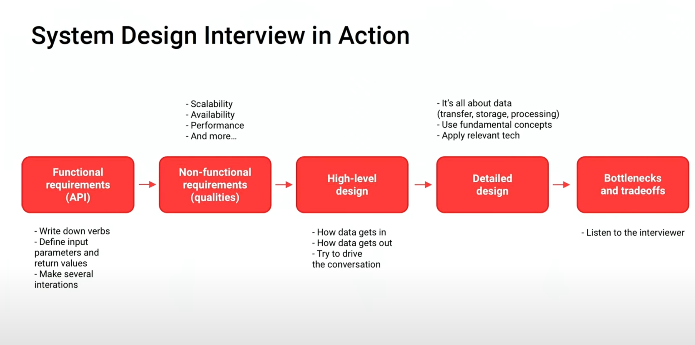
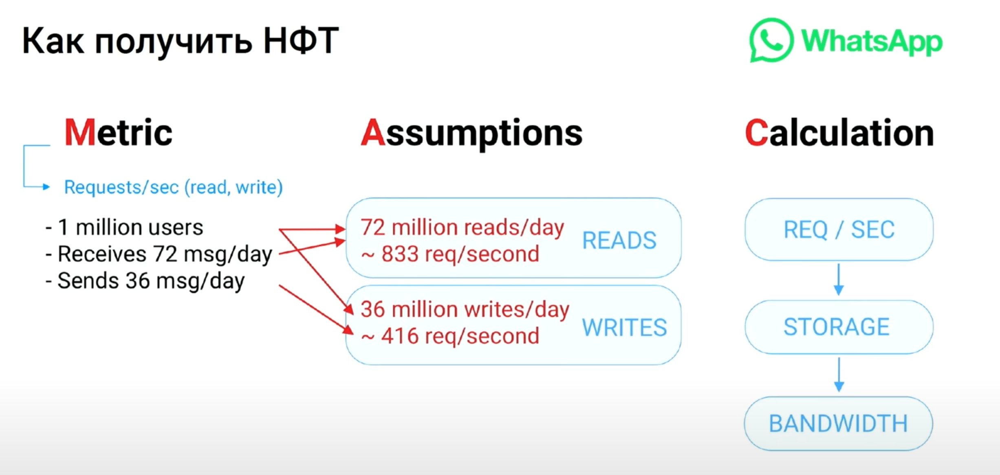
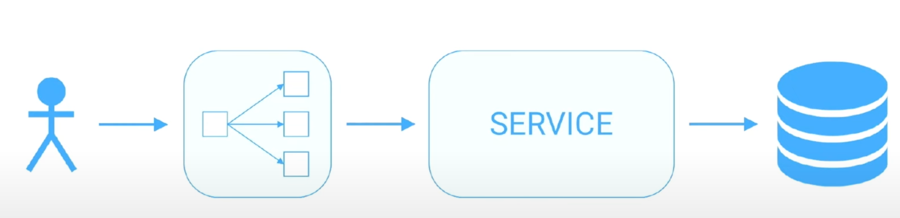
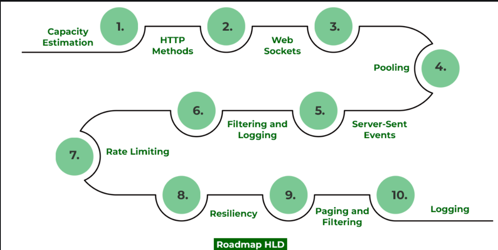

# [Владимир Маслов — System Design. Как построить распределенную систему и пройти собеседование](https://www.youtube.com/watch?v=popkBBjbAv8)

Какую систему строим?
* Популярный сервис с нуля
* Новая фича для работающего известного севриса
* Архтитектура вашего проекта 

## Ошибка номер раз - надо начать задавать вопросы. https://www.youtube.com/watch?v=LgUNchFaN9Q

## Структура собеса

1) Уточнение требований
2) Вычислением нефункциональных требований
3) Прикинуть API/интерфейсы
4) Определить модель данных
5) Высокоуровневый дизайн
6) Низкоуровневый дизайн
7) Поиск и устранение ботлнеков

Сигналы, которые хочет увидеть интервьюер:
* Уметь понятно выражать свои идеи и отстаивать технические решение
* Наличие навыка проектирования и практического опыта
* Понимание вашего дизайна: сможет ли он масштабироваться, можете ли вы его улучшить, трейдоффы

## Функциональные требования

* Какие возможности у системы, которая она дает пользователю?
* Насколько она должна быть надежной, отзывчивой?
* Какие упущения допустимы?
* Какие ограничения должны быть у системы?
 

Алгоритм сбора требований:
* Вспоминаем известные нам свойства системы
* Записываем их на доске
* Уточняем у интервьюера какие из функций системы будем обсуждать в ходе интервью
* Стараемся, чтобы требования были приоритезированы в порядке убывания значимости. **Не стараемся спроектировать ВСЕ.** 

Пример: Dropbox/ Google Drive
* пользователь может загружать данные
* пользователь может управлять данными с различных устройств
* устройства будут синхронизироваться
* пользователи могут шарить файлы/папки
* доступы read/write к файлам/директориям
* пользователи могут настроить тарифный план
* поддержка загрузки больших файлов

## Нефункциональные требования

SLA/SLO

Метрики НФТ ( **ОШИБКА не уточнить детали**)
* DAU/MAU (daily/montlhy active users )
* Кол-во пользователей через 5/10 лет
* кол-во операций пользоавтелем в день
* RPS, сетевой трафик и кол-во соединений
* CPU
* HDD/SSD (дисочки)
* Стоимость

Спросить сколько пользователей, сколько операций(сообщений), предположить RPS и переложить в требования

[шпаргалка с числами для system design interview ](https://gist.github.com/mwakaba2/8ad25dda8c71fe529855994c70743733)

### Хранение данных
* Нужно думать не только про задачи системы, но и про хранение на железе
* Есть ли в системе изображения/видео?
* Сколько места под данные нам потребуется? Какого рода хранилища?
* Сколько серверов и стораджа нужно нам для выполнения? 

Пример расчета:
DAU: 100 mil
RPS: 10k/s
Хранение данных daily: 400GB
Хранение данных 10 years: 1.4PB
Трафик: 10MB/s

Мета:
Этап нужен не для быстрых расчетов, но нельзя делать его некорректно или медленно
Стоит научиться делать расчет быстро - например< быстро возводить в степень (см Google SRE book)
РАсчет покажет где есть ограничения по CPU/storage/ram
на этапе HLD вы решаете какими средствами вы будете масштабировать bottleneck

## High level design

Сделайте стандартный простой дизайн системы, потом эволюционируйте его

Прогоняем наш дизайн по HLD ROADMAP

[Описание HLD от geeksforgeeks](https://www.geeksforgeeks.org/what-is-high-level-design-learn-system-design/)

**ОШИБКИ**
Помните, что вам доступно только 85% обьема диска
За год выходят из строя 3-5% дисков
Может быть ограничение на макс размер диска для БД
Не забудьте умножить число на фактор репликации

## Компоненты системы

Библиотека компонентов
* Domain name system
* Load balancers
* Rate limiter
* Databases
* K/V store
* CDN
* Message Queue
* Monitoring
* Distributed Logging
* Caching

SQL VS NOSQL - это важно, надо разобраться

Детализация схемы данных, ERD 

Будут вопросы почему технология A, а не B. Надо пояснить, желательно на примерах

## Scaling 
CAP-theorem  

Балансировка нагрузки - различия между балансировщиками.  
Кэширование - оценить горячие/холодные данные. Нужно понять что мы будем кэшировать, как долго держать в кэше, как обновлять и инвалидировать
DNS -
CDN - 

Полезные приемы:
* Кэширование
* Шардирование
* Репликация
* Индексирование
* Consistent Hashing

## Interview Preparation. Как подготовиться к собесу

* Кабанчик
* Grokking the system design interview
* Alex xu - System design interview (подход к сложным интервью)
* interviewing.io
* https://www.youtube.com/@systemdesigninterview
* https://habr.com/ru/companies/yandex/articles/564132/
* https://github.com/donnemartin/system-design-primer
* https://github.com/madd86/awesome-system-design

## Как изучить System design

* 5 mins a day ByteByteGo
* Читать про System design
* Читать про SRE 
* Читайте блоги highscalability.com, blog.bytebytego.com, softwareengineeringdaily.com

Практика
* Мокинтервью 
  * pramp.com
  * tryexponent.com
* pet-проекты
* стартапы
* сообщества 
  * t.me/sysdesign_interview
  * книжный клуб {между скобок}
  * t.me/system_design_interviews

