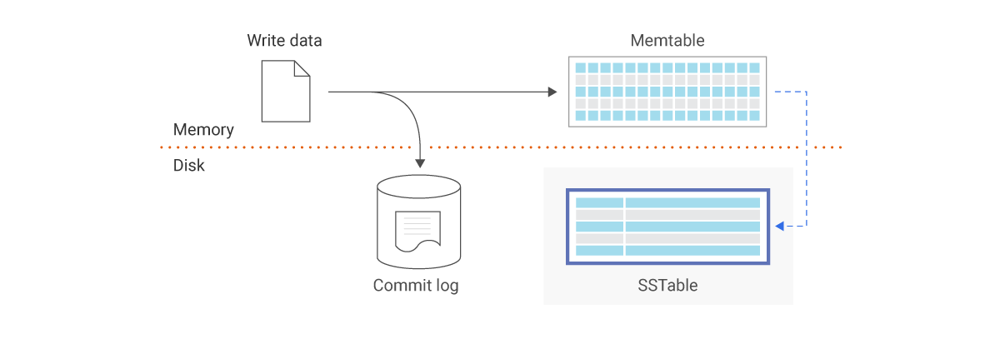
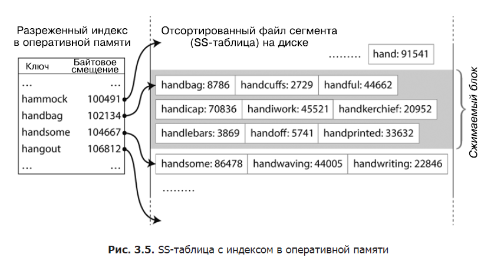
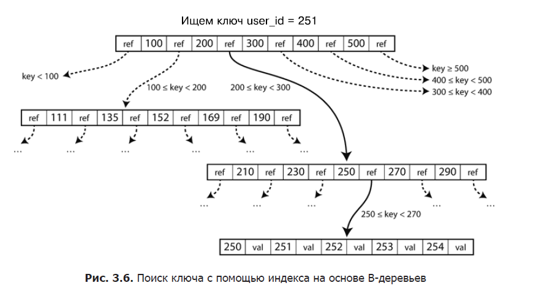
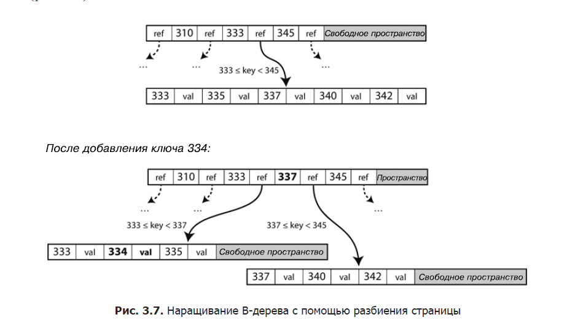

# Часть 1. Глава 2 

### Хеш индексы

в случае с локальной БД с аппендом в конец можно использовать хэш-индекс

Реализуется хэш-таблицей, где слева будет ключ, а справа будет сдвиг в файле данных, где находится value

Аппенд в конец предпочтительнее замены нового по следующим признакам:
* последовательные операции записи, в большинстве случаев выполняющиеся намного быстрее случайной записи, особенно на магнитных жестких дисках с раскручивающимися пластинами.
Последовательная запись до некоторой степени предпочтительна и в случае твердотельных накопителей (solid state drive, SSD) на основе флеш-памяти. 
* Конкурентный доступ и восстановление после сбоев сильно упрощаются в случае допускающих только добавление или вообще неизменяемых файлов данных.
* Слияние старых сегментов позволяет решить проблему фрагментирования файлов данных с течением времени.

Ограничения индексов по хэш-таблицам: 
* Должна помещаться в оперативной памяти, если много ключей, то беда
* Запросы по диапазону не эффективны, так как необходимо искать каждый ключ в хэш-картах

## SS-таблицы и LSM-Деревья
Мы собираемся сейчас поменять формат наших файлов сегментов: потребовать,
чтобы последовательность пар «ключ — значение» была отсортирована по ключу. 
Назовем новый формат отсортированной строковой таблицей (**sorted string table**, **SSTable**), сокращенно — **SS-таблицей**. 

**SSTable**  
_Sorted Strings Table (SSTable) is a persistent file format used by ScyllaDB, Apache Cassandra, and other NoSQL databases to take the in-memory data stored in memtables, order it for fast access, and store it on disk in a persistent, ordered, immutable set of files.
Immutable means SSTables are never modified. They are later merged into new SSTables or deleted as data is updated._

Теперь мы организуем работу нашей подсистемы хранения следующим образом.
* При поступлении записи добавляем ее в располагающуюся в оперативной памяти сбалансированную структуру данных (например, красно-черное дерево).
Это располагающееся в оперативной памяти дерево называется MemTable (от memory table — «таблица, расположенная в памяти»).
* Когда размер MemTable превышает определенное пороговое значение — обычно несколько мегабайт, — записываем его на диск в виде файла SS-таблицы. Эта операция выполняется достаточно эффективно, поскольку дерево поддерживает пары «ключ — значение» в отсортированном по ключу виде (merge sort).
Новый файл SS-таблицы становится последним сегментом базы данных. А пока SS-таблица записывается на диск, операции записи продолжают выполняться в новый экземпляр MemTable.
* Для обслуживания запроса на чтение сначала пробуем найти ключ в MemTable, затем в последнем по времени сегменте на диске, затем в предпоследнем и т. д.
* Время от времени запускаем в фоне процесс слияния и уплотнения, чтобы объединить файлы сегментов и отбросить перезаписанные или удаленные значения.

Плюсы SS-таблиц:

* Обьединение выполняется просто и эффективно, даже если размер файлов превышает обьем доступной оперативной памяти
* Чтобы найти в файле конкретный ключ, не нужно больше хранить индекс всех ключей в оперативной памяти. Можно определить в каком промежутке находится и пойти его перебирать
* Поскольку для выполнения запроса на чтение все равно необходимо просмотреть несколько пар «ключ — значение» из заданного диапазона, вполне можно сгруппировать эти записи в блок и сжать его перед записью на диск

## Log-Structured Merge-Tree, LSM-Tree

## B-tree
Аналогично SS-таблицам B-деревья хранят пары «ключ — значение» в отсортированном по ключу виде, что позволяет эффективно выполнять поиск значения по ключу и запросы по диапазонам.
B-деревья разбивают БД на блоки или страницы фиксированного размера, обычно 4 КБайт и читают?Записывают по одной странице за раз.
Все страницы имеют свой адрес/местоположение, благодаря чему одни страницы могут ссылаться на другие — аналогично указателям, но на диске, а не в памяти.
Этими ссылками на страницы можно воспользоваться для создания дерева страниц

При необходимости обновить значение для существующего ключа в B-дереве нужно найти содержащую этот ключ страницу-лист, изменить там значение и записать ее обратно на диск (все ссылки на данную страницу останутся рабочими).
В случае надобности добавить новый ключ следует найти страницу, в чей диапазон попадает новый ключ, и добавить его туда.
Если на странице недостаточно места для него, то она разбивается на две полупустые страницы, а родительская страница обновляется, чтобы учесть это разбиение диапазона ключей на части

Представленный алгоритм гарантирует, что дерево останется сбалансированным, то есть глубина B-дерева с n ключами будет равна **O(log n**).  
Большинству баз данных хватает деревьев глубиной три или четыре уровня, поэтому вам не придется проходить по множеству ссылок на страницы с целью найти нужную (четырехуровневое дерево страниц по 4 Кбайт с коэффициентом ветвления в 500 может хранить до 256 Тбайт информации).