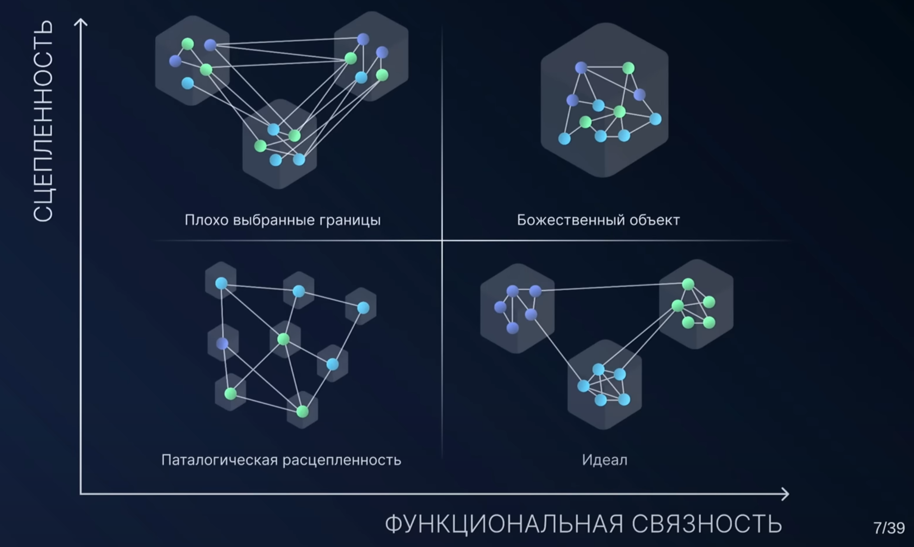

# [Алексей Жидков — Рациональный подход к декомпозиции систем на модули или микросервисы](https://www.youtube.com/watch?v=7u7LGhXlpcE)

[Статья на хабр](https://habr.com/ru/companies/jugru/articles/731424/)   
[Статья на блоге автора](https://azhidkov.pro/posts/23/04/ergonomic-decomposition/)

 
 
Декомпозиция должна делить на модули с высокой степенью изоляции 

Горизонтальная декомпозиция

Controller - service - repository

Чем плохо - плохо выбираются границы, начинается нарушение доменов, могут появиться циклы в системе

Вертикальная декомпозиция: 

**Декомпозиция по сущностям:**  
Сложные моменты:
* что делать если у меня 50 сущностей?
* что делать если у меня нет сущностей?
* куда положить код, который затрагивает две сущности?

**Декомпозиция по фичам:**  
Сложные моменты:
* Что такое фича?
* Как найти границы фич в требованиях?
* Как понять к какой фиче относится строчка кода?

**Domain driven design**  
Классная штука, но не всегда работает

**Декомпозиция на базе эффектов:**  
Концептуальная модель системы
- операции
- ресурсы
- эффекты чтения и записи

Операции - атомарные единицы работы системы (== адаптеры в гексагональной)
* Обработчики запросов HTTP
* Листнеры очередей сообщений
* Обработчики событий планировщика

Ресурсы - Именованные области состояния системы ( == порты в гексагональной)
* таблицы в рсубд
* очереди сообщений
* внешние REST API
* Файлы
* Глобальные переменные

Эффекты - акты взаимодействия с ресурсами
Чтения: select , http get, file read, global var read 
Запси: insert, http post, file write, global var write

В таком случае задача декомпозиции системы сводится к задаче кластеризации диаграммы эффектов  
* Ресурсы являются глобальными переменными. Минимизация области видимоти глобальных переменных снижает общую сцепленность
* Эффекты записи создают большую сцепленность. Инкапсуляция эффектов записи имеет большее значение, чем эффектов чтения

Оценка качества кластеризации
* Нет циклов
* Все эффекты записи инкапсулированы в одном кластере
* Минимум эффектов чтения между кластерами
* Каждому кластеру легко дать имя по его содержанию

## Алгоритм кластеризации диаграммы эффектов

Кластеризация:
* генерация кластеров
  * Перебрать некластеризированные ресурсы
  * Кластеризовать с сильно сцепленными операциями (*)
* расширение кластеров
  * Перебрать некластеризированные элементы
    * Затянуть в кластеры, если элемент связан только с элементами одного кластера
    * Перебрать ресурсы, связанные через общую операцию. Объединить если получается разумная группа (*)
* агрегация ресурсов

Оптимизация кластеров

* Именование кластеров 
* проверить разумность связей
* проверка связей
* группировка кластеров 
  * сокрытие подмодулей
  * обьединение сильно связанных модулей

    

_Операция является сильно сцепленной_ если
* данный ресурс является единственным для этой операции
* операция связана с ресурсом ЕДИНСТВЕННЫМ эффектом записи
* операция на чтение, для которой ресурс является первичным

_Разумная группа._ 
Если удаление одного из ресурсов делает существование другого ресурса бессмысленным - то это группа ресурсов.

 

# Практика
Проект КЭМП:
Дальнобоям на пути следования нужно предложить кафе, ночлег, СТО

Исходные данные:  
* Точки на карте 
* Характеристики машин
* Пользователи

Аутентификация и простая авторизация:
OTP для водителей, логин пароль для админов

Уведомления:
Новостные и персональные

## Алгоритм

### Объединяем ресурсы и сильно связанные операции:

У ресурса есть две операции, которые связаны только эффектами записи - **изменить** и **удалить** **пользователя**, закидываем в кластер.
Так же есть операция **Получить пользователя**, для которой данный ресурс является первичным

То же самое для уведомлений, выделяем кластера по критериям, оставляем некластеризованные элементы

### Расширение кластеров 
Если элемент связан только с элементами одного кластера - затягиваем его
Обьединяем и Повторяем 

### Проверяем связи

